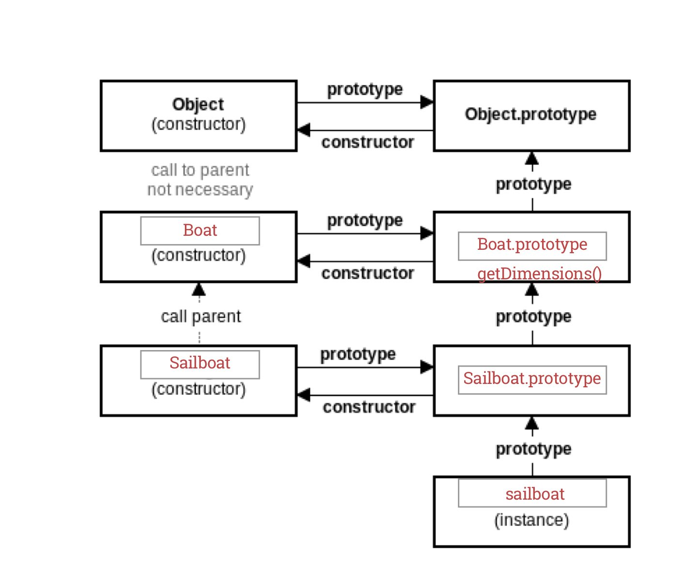

#Prototypal Inheritance

### What is Inheritance, and why do we want to use it?

Inheritance is a way for objects to inherit properties from other objects. This allows for your code to be organized and prevent needless repetition.

For example, there are many types of boats in the world, but all of them have properties in common. We can organize our objects so that all the different types of boats (steamboat, sailboat, motorboat) inherit properties that they share, instead of repeating them in each object.

**The repetitive way**
```js
function Sailboat(length, width, sails) {
  this.length = length;
  this.width = width;
  this.sails = sails;
}

function Steamboat(length, width, smokeStacks) {
  this.length = length;
  this.width = width;
  this.smokeStacks = smokeStacks;
}

function Motorboat(length, width, motors) {
  this.length = length;
  this.width = width;
  this.motors = motors;
}
```

**The inheritance way**
```js
function Boat(length, width) {
  this.length = length;
  this.width = width;
}

function Sailboat(length, width, sails) {
  Boat.call(this, length, width);
  this.sails = sails;
}
Sailboat.prototype = Object.create(Boat.prototype);
Sailboat.prototype.constructor = Sailboat;


function Steamboat(length, width, smokeStacks) {
  Boat.call(this, length, width);
  this.smokeStacks = smokeStacks;
}
Steamboat.prototype = Object.create(Boat.prototype);
Steamboat.prototype.constructor = Steamboat;


function Motorboat(length, width, motors) {
  Boat.call(this, length, width);
  this.motors = motors;
}
Motorboat.prototype = Object.create(Boat.prototype);
Motorboat.prototype.constructor = Motorboat;
```

By using inheritance, we can group shared properties into the prototype and now all boats have that those properties! We can also extend this functionality to functions!

```js
Boat.prototype.getDimensions = function() {
  console.log('This boat has a width of ' + this.width + ' and a length of ' + this.length);
}
```

Now the Sailboat, Steamboat, and Motorboat can all use the `getDimensions` function, through what's called the **prototype chain**.




Whenever an object doesn't directly have a function or property, it traverses up the prototype chain to see if any parents have it. In this case, SailBoat, Steamboat, and Motorboat go up to their parent (Boat) and see that Boat has a `getDimensions` function.
